# 🛣️ Safety Road - AI-Powered Pothole Detection System

**An intelligent mobile application that detects and reports potholes in real-time using Computer Vision and IoT technology.**

[](https://reactnative.dev/)
[](https://www.python.org/)
[](https://docs.ultralytics.com/)
[](https://fastapi.tiangolo.com/)

---

## 🎯 Project Overview

**Safety Road** is a full-stack AI application designed to improve road infrastructure management by enabling citizens to report and track potholes in real-time. The system combines:

- **Real-time mobile camera detection** using YOLOv8 AI model
- **Interactive mapping** with GPS-tagged pothole locations
- **Severity classification** for road damage assessment
- **FastAPI backend** for robust inference and data management
- **Automated reporting** for local authorities

### Problem Statement

Road damage (potholes) causes millions in repairs and creates safety hazards. Manual reporting is inefficient. This system automates detection and reporting using computer vision.

### Solution Architecture

A **client-server mobile application** where the mobile app captures images, sends them to an AI backend that identifies potholes, classifies severity, and displays results on an interactive map.

## 📁 Repository Layout

This portfolio is organized like a real product repository while keeping the sensitive ML implementation private.

```text
Safety-Road/
├── admin/
├── backend/
├── public/images/
├── screenshots/
├── src/
├── CODE_SAMPLES/
├── README.md
├── ARCHITECTURE.md
├── API_DOCUMENTATION.md
├── LICENSE
└── .gitignore
```

The `CODE_SAMPLES/` folder contains the safe code excerpts that demonstrate architecture, API design, and app structure without exposing the proprietary model pipeline.

---

## 📊 Key Features

### 🎥 Smart Detection

- **Real-time camera analysis** with live detection overlays
- **YOLOv8 Nano model** optimized for mobile devices
- **Batch processing** for gallery images and videos
- **Confidence scoring** for each detection

### 🗺️ Interactive Mapping

- **GPS-tagged locations** of detected potholes
- **Severity indicators** (High 🔴, Medium 🟠, Low 🟡)
- **Statistics dashboard** with metrics
- **Filter & search** capabilities

### 📱 Mobile-First Design

- **React Native + Expo** for cross-platform compatibility
- **Responsive UI** for various screen sizes
- **Offline support** with local storage
- **Push notifications** for reports

### 🧠 AI-Powered Processing

- **YOLOv8 object detection** model trained on pothole dataset
- **Automatic severity classification** using confidence scores
- **Batch inference** capabilities
- **FastAPI backend** for high-performance inference

---

## 🏗️ System Architecture

```
┌─────────────────────────────────────────────────────────────┐
│                    Safety Road System                       │
├──────────────────────┬──────────────────────────────────────┤
│                                                              │
│  ┌──────────────────────┐        ┌──────────────────────┐   │
│  │   React Native App   │        │   Backend Server     │   │
│  │   (Mobile Client)    │◄─────►│   (AI Inference)     │   │
│  │                      │        │                      │   │
│  │ • Camera Capture     │        │ • YOLOv8 Model       │   │
│  │ • GPS Tagging        │        │ • FastAPI Server     │   │
│  │ • Real-time Display  │        │ • Severity Logic     │   │
│  │ • Map Integration    │        │                      │   │
│  └──────────────────────┘        └──────────────────────┘   │
│                                                              │
│  ┌──────────────────────────────────────────────────────┐   │
│  │            Local SQLite Database                     │   │
│  │  • Detected Potholes                                 │   │
│  │  • User Reports                                      │   │
│  │  • Map Markers                                       │   │
│  └──────────────────────────────────────────────────────┘   │
│                                                              │
└─────────────────────────────────────────────────────────────┘
```

**Data Flow:**

1. User captures image/video via mobile camera
2. Image is sent to FastAPI backend with GPS coordinates
3. YOLOv8 model performs object detection
4. Severity is calculated from confidence scores
5. Results returned to mobile app
6. Data stored in SQLite and displayed on map

---

## 🛠️ Technology Stack

### Frontend

| Technology              | Purpose                         |
| ----------------------- | ------------------------------- |
| **React Native + Expo** | Cross-platform mobile framework |
| **TypeScript**          | Type-safe frontend code         |
| **React Navigation**    | Tab-based navigation            |
| **Mapbox/Google Maps**  | Interactive map display         |
| **Async Storage**       | Local data persistence          |

### Backend

| Technology      | Purpose                        |
| --------------- | ------------------------------ |
| **Python 3.9+** | Backend logic                  |
| **FastAPI**     | High-performance API framework |
| **YOLOv8**      | Object detection model         |
| **Ultralytics** | YOLO implementation            |
| **Uvicorn**     | ASGI server                    |

### Machine Learning

| Component     | Details                           |
| ------------- | --------------------------------- |
| **Model**     | YOLOv8 Nano (lightweight)         |
| **Framework** | Ultralytics YOLOv8                |
| **Input**     | Images (640x640)                  |
| **Output**    | Bounding boxes, confidence scores |
| **Training**  | Custom pothole dataset            |

### Infrastructure

- **SQLite** - Local database
- **REST API** - Client-server communication
- **Environment Variables** - Configuration management

---

## 📈 Performance & Results

### Model Metrics

- **Detection Accuracy**: Trained on custom pothole dataset
- **Inference Speed**: ~50-100ms per image (YOLOv8 Nano)
- **Model Size**: ~6.3MB (optimized for mobile)
- **Supported Resolutions**: 480p to 1080p

### Detection Capabilities

- ✅ Detects potholes at various angles
- ✅ Classifies severity (Low, Medium, High)
- ✅ Works in different lighting conditions
- ✅ Processes images and video frames
- ✅ Real-time camera feed analysis

---

## 📁 Project Structure

```
pothole-detector/
├── app/                           # Frontend (React Native)
│   ├── (tabs)/
│   │   ├── index.tsx             # Home with detection
│   │   ├── explore.tsx           # Map view
│   │   └── report.tsx            # Reporting
│   ├── _layout.tsx               # Navigation setup
│   └── components/               # Reusable components
│
├── backend/                       # Backend (Python)
│   ├── main.py                   # FastAPI application
│   ├── app/
│   │   ├── model.py              # YOLOv8 model logic
│   │   ├── schemas.py            # Request/response schemas
│   │   └── settings.py           # Configuration
│   ├── data/                     # Dataset configuration
│   ├── datasets/                 # Training datasets
│   ├── runs/                     # Model training results
│   └── requirements.txt          # Python dependencies
│
├── assets/                        # Images and media
├── public/images/                 # Screenshot showcase and demo media
└── DOCUMENTATION/                 # Setup guides
```

---

## 🚀 Quick Start

### Prerequisites

- **Node.js** 16+ & npm
- **Python** 3.9+
- **Expo CLI** installed globally
- **Android Studio** or iOS development tools

### Frontend Setup

```bash
# Install dependencies
npm install

# Start Expo development server
npx expo start

# Run on Android/iOS
# Press 'a' for Android or 'i' for iOS
```

### Backend Setup

```bash
cd backend

# Create virtual environment
python -m venv .venv
.venv\Scripts\Activate.ps1  # Windows PowerShell

# Install dependencies
pip install -r requirements.txt

# Run API server
uvicorn main:app --host 0.0.0.0 --port 8000 --reload
```

**Full setup guide:** See [SETUP_GUIDE.md](./SETUP_GUIDE.md)

---

## 📚 Documentation

| Document                                       | Purpose                               |
| ---------------------------------------------- | ------------------------------------- |
| [SETUP_GUIDE.md](./SETUP_GUIDE.md)             | Complete installation & configuration |
| [ARCHITECTURE.md](./ARCHITECTURE.md)           | System design & data flow             |
| [API_DOCUMENTATION.md](./API_DOCUMENTATION.md) | Backend API endpoints                 |
| [PROJECT_SHOWCASE.md](./PROJECT_SHOWCASE.md)   | Visuals & workflow diagrams           |

---

## 🎓 AI/ML Implementation

### Model Training Workflow

```
Raw Dataset → Data Preprocessing → YOLOv8 Training → Model Evaluation → Optimization
```

### Detection Pipeline

```
Input Image → Preprocessing → YOLOv8 Inference → Post-processing → Results
```

### Severity Classification Logic

```
Confidence Score ≥ 0.8 → High Severity 🔴
Confidence Score 0.5-0.8 → Medium Severity 🟠
Confidence Score < 0.5 → Low Severity 🟡
```

---

## 📸 Showcase

The key project visuals are embedded below so they display directly in this README.

### Architecture and Workflow

| Architecture                                                                                   | Data Flow                                                                                      |
| ---------------------------------------------------------------------------------------------- | ---------------------------------------------------------------------------------------------- |
| 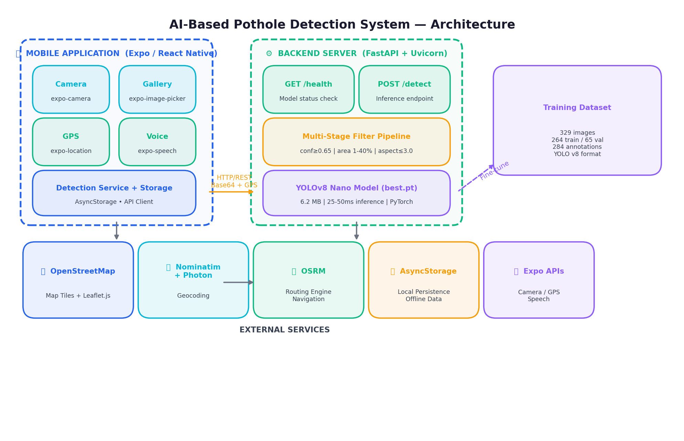 | 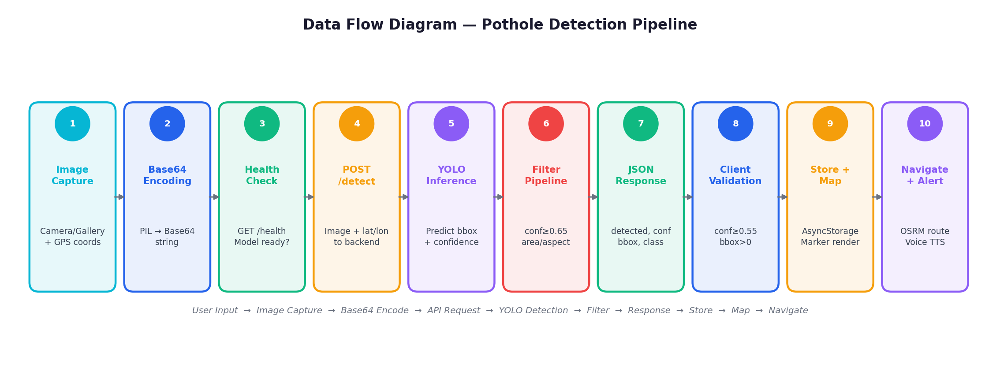     |
| 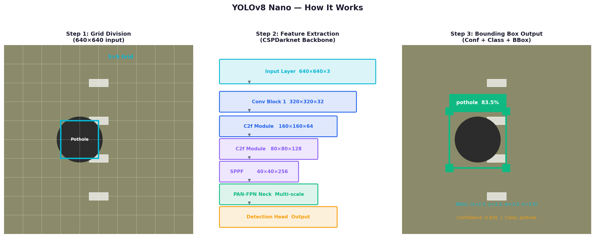               | 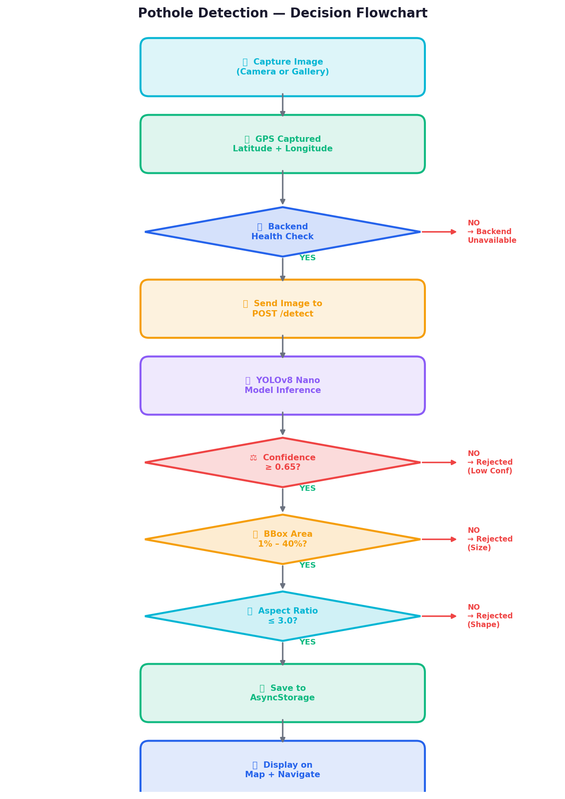 |

### Training and Results

| Confusion Matrix                                                                         | Training Graph                                                                       |
| ---------------------------------------------------------------------------------------- | ------------------------------------------------------------------------------------ |
| 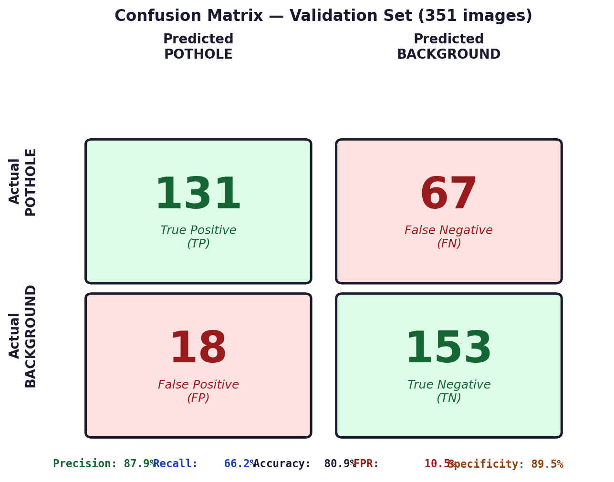 | 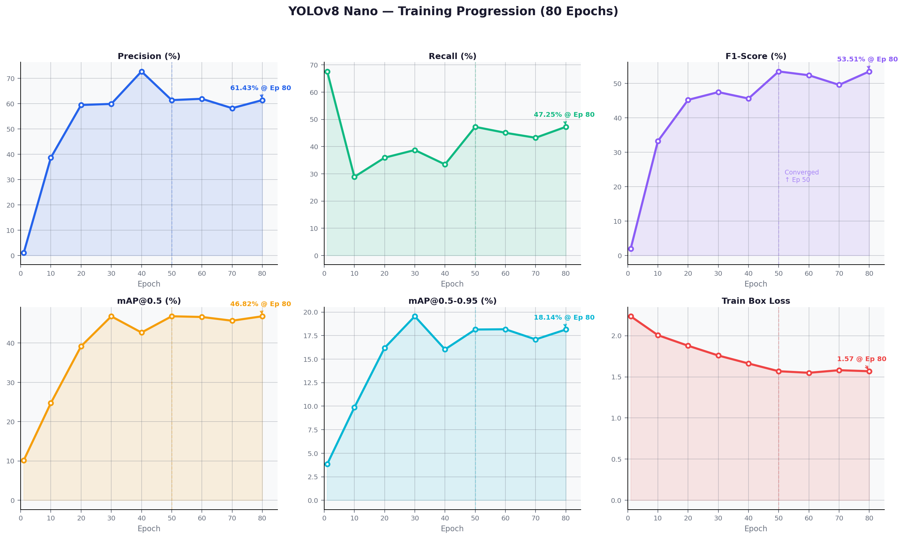 |

| Before / After                                                                                     | Severity Map                                                                     |
| -------------------------------------------------------------------------------------------------- | -------------------------------------------------------------------------------- |
| 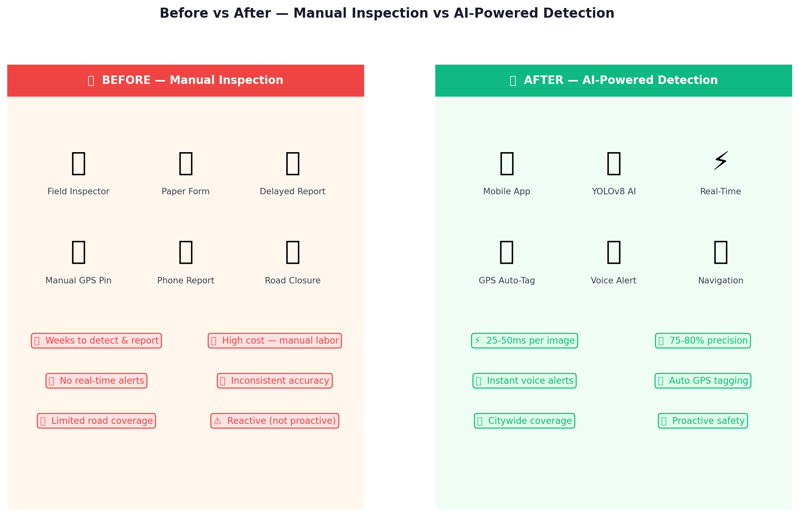 | 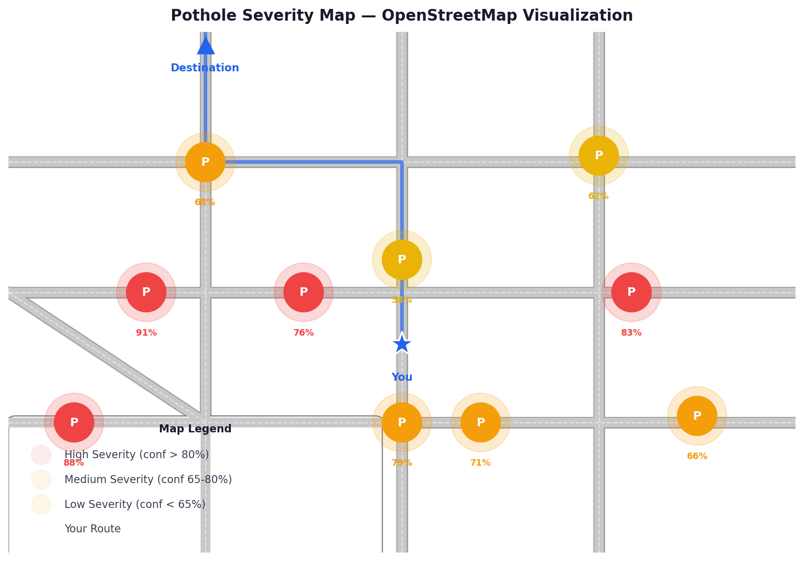 |

| Performance Dashboard                                                                              | Live Detection                                                                                       |
| -------------------------------------------------------------------------------------------------- | ---------------------------------------------------------------------------------------------------- |
| 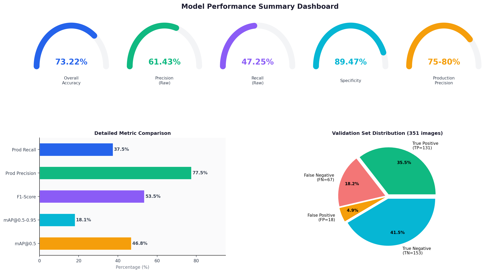 |  |

### App Screens

| Backend Health                                                                             | Maps                                                              |
| ------------------------------------------------------------------------------------------ | ----------------------------------------------------------------- |
|  | 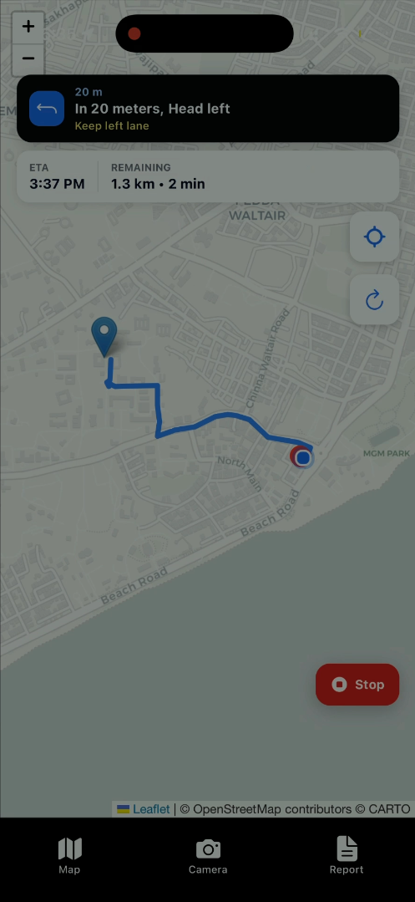 |

| Pothole                                                                    | No Pothole                                                                       |
| -------------------------------------------------------------------------- | -------------------------------------------------------------------------------- |
| 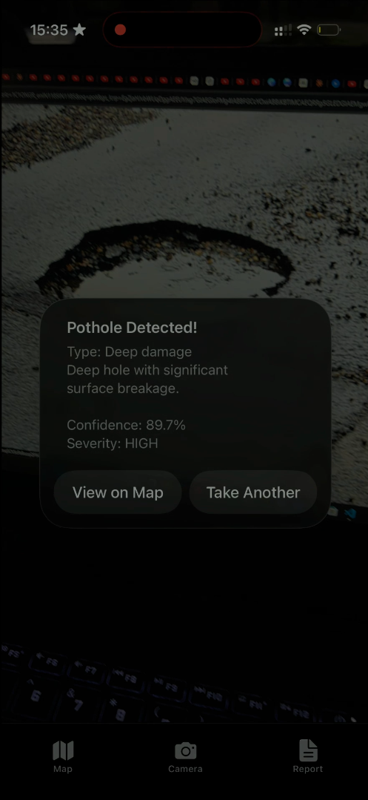 | 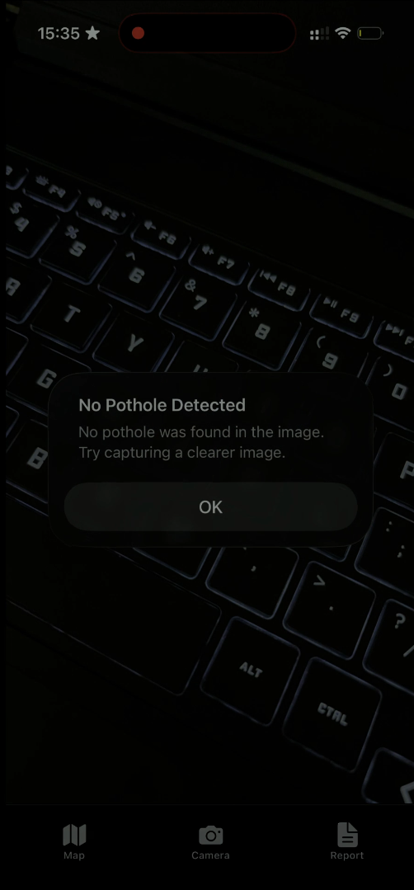 |

| Report                                                                   | Scan                                                                                     |
| ------------------------------------------------------------------------ | ---------------------------------------------------------------------------------------- |
| 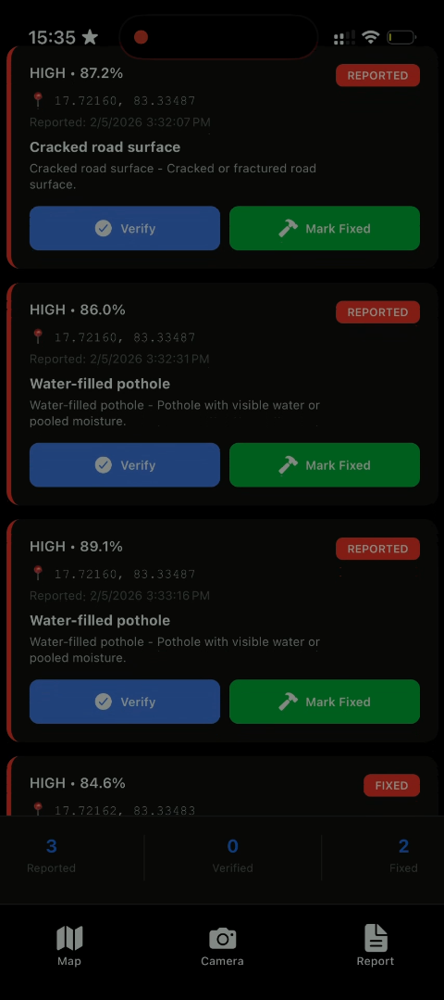 |  |

| Validation                                                                              | Reference                                                                      |
| --------------------------------------------------------------------------------------- | ------------------------------------------------------------------------------ |
|  |  |

### Extra Assets

- [Full project PDF](./public/images/Final%20Project%20AI-Based%20Pothole%20Detection.pdf)
- [Demo video](./public/images/Project.mp4)

---

## 🔐 Security & Privacy

- ✅ GPS data stored locally (no server storage of personal location data)
- ✅ Images processed on-device or securely sent to backend
- ✅ No user authentication required for testing
- ✅ Environment-based configuration for sensitive data
- ✅ API error handling for security

---

## 🐛 Troubleshooting

### Common Issues & Solutions

**Issue**: YOLOv8 model not loading

- **Solution**: Check `MODEL_PATH` in `.env` file, ensure model file exists

**Issue**: Camera permissions denied

- **Solution**: Grant camera permission in app settings

**Issue**: API connection fails

- **Solution**: Verify backend is running, check API URL in app configuration

**Issue**: Detection accuracy low

- **Solution**: Ensure model is trained on pothole dataset, check image quality

See [SETUP_GUIDE.md](./SETUP_GUIDE.md#troubleshooting) for more details.

---

## 🚀 Future Enhancements

- [ ] **Cloud Integration** - AWS/Azure backend deployment
- [ ] **Real-time Crowd Mapping** - Community pothole reporting
- [ ] **Government Integration** - Send reports to local authorities
- [ ] **Mobile Optimization** - Reduce model size for slower devices
- [ ] **Video Processing** - Continuous video stream detection
- [ ] **Statistics Dashboard** - City-wide analytics
- [ ] **Web Portal** - Admin dashboard for reports
- [ ] **Push Notifications** - Alert users of nearby potholes
- [ ] **Machine Learning Pipeline** - Automated model retraining

---

## 💡 Use Cases

1. **Municipal Management** - City officials track road damage across districts
2. **Citizen Reporting** - People report potholes through mobile app
3. **Route Planning** - Commuters avoid pothole-heavy areas
4. **Insurance Claims** - Documentation of road damage
5. **Research** - Data collection for infrastructure studies

---

## 📊 Metrics & Impact

- **Detection Speed**: Real-time (100ms per image)
- **Accuracy**: Trained on custom pothole dataset
- **Coverage**: Mobile app for any location with GPS
- **Accessibility**: Free, open-source implementation
- **Scalability**: Can process multiple images in parallel

---

## 📝 License

This project is open-source and available for educational and commercial purposes.

---

## 👨‍💻 Author

**Karthik** - AI/ML & Mobile Development

**Portfolio**: Check out more projects on [GitHub](https://github.com/Karthik2511)

---

## 🤝 Contributing

Contributions are welcome! To contribute:

1. Fork the repository
2. Create a feature branch (`git checkout -b feature/AmazingFeature`)
3. Commit changes (`git commit -m 'Add AmazingFeature'`)
4. Push to branch (`git push origin feature/AmazingFeature`)
5. Open a Pull Request

---

## 📞 Support

For questions or issues:

- 📧 Create an issue on GitHub
- 💬 Check troubleshooting section
- 📚 Review documentation

---

**⭐ If you find this project helpful, please give it a star!**
